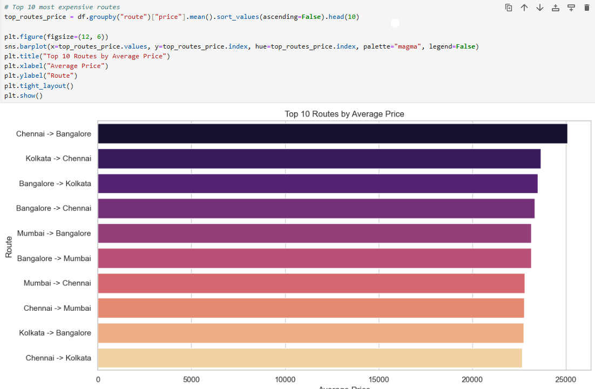
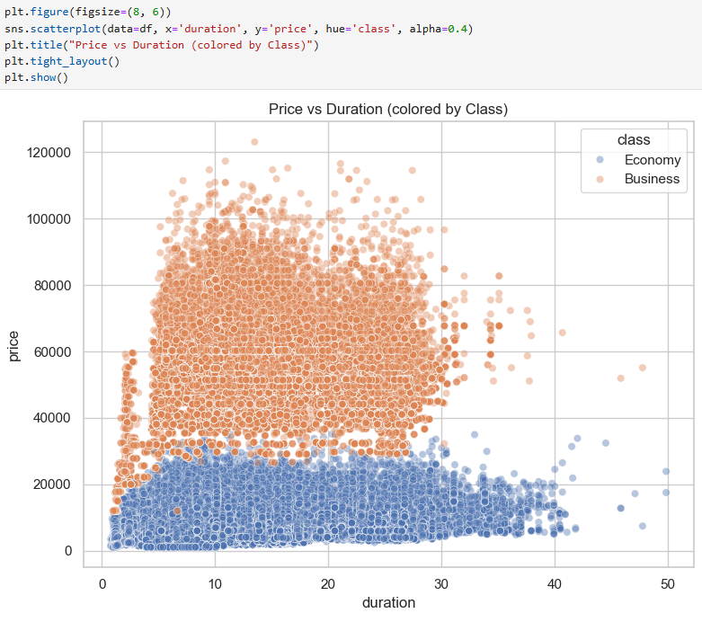
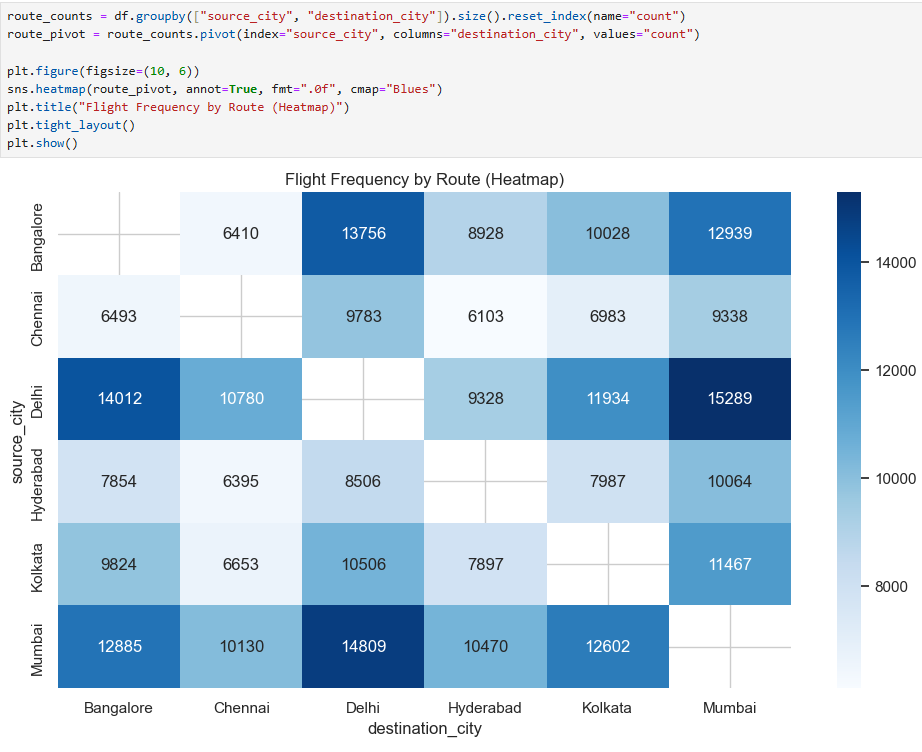
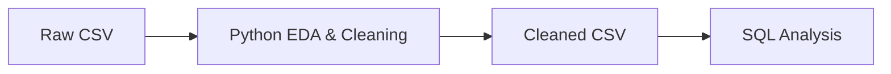

# ✈️ Airline Flights - Python Exploratory Data Analysis (EDA)

This notebook explores commercial flight data to uncover patterns in pricing, routes, and booking behavior. The goal is to prepare clean data for SQL and dashboard analysis, while also gaining early business insights.

---

## 🧠 Business Context

The Python EDA lays the groundwork for answering key business questions about airline performance. It focuses on features that influence pricing, booking urgency, and class preferences. Insights from this stage help shape the SQL queries used later in the project.

---

## 🔍 EDA Goals

- Separate and explore categorical and numerical features
- Understand price distribution and variation
- Analyze booking urgency and its effect on pricing
- Visualize how class, stops, and route influence flight characteristics

---

## 📊 Techniques Used

- Univariate and bivariate analysis
- Visualizations with seaborn & matplotlib
- Feature engineering (e.g., `booking_urgency`, `duration_category`, `route`)
- Outlier inspection and column transformation

---

## 📸 Visual Examples

### Average Price per Route

### Duration vs Price

### Route Frequency Heatmap

---

## 🧹 Output

- Cleaned dataset (`cleaned_airline_data.csv`)
- Summary statistics and visual plots
- Insights to inform SQL and Power BI analysis

---

## 🔄 Project Workflow

---

## ✅ Next Steps

- Load `airline_flights_cleaned.csv` into MySQL
- Write SQL queries to analyze pricing, routes, and demand
