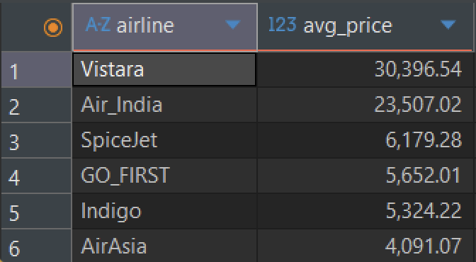
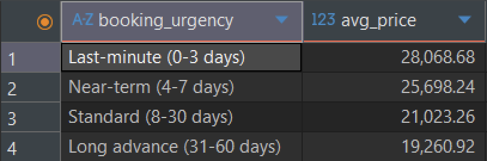
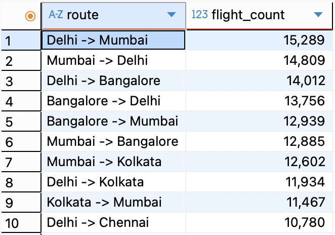

# 🛫 SQL Analysis - Airline Flight Data

This folder contains SQL queries written to analyze airline ticket pricing, booking behavior, and route performance. The goal is to transform cleaned flight data into actionable business insights.

---

## 🎯 Purpose

To answer key business questions using SQL queries that support strategic decision-making in areas like pricing optimization, route planning, and customer targeting.

---

## 📁 Folder Contents

- `airline_flight_analysis_queries.sql`: Full list of SQL queries with comments
- `images/`: Screenshots of selected query results and visual outputs
- `README.md`: This documentation file

---

## 🔍 SQL Insights Overview

Below are the key queries and what they inform:

### 1. Average Price per Airline
> Understand which airlines are priced higher on average.

```sql
SELECT airline, ROUND(AVG(price), 2) AS avg_price
FROM flights
GROUP BY airline
ORDER BY avg_price DESC;
```


---

### 2. Booking Urgency vs Price
> See how price changes based on how early or late customers book.

```sql
SELECT booking_urgency, ROUND(AVG(price), 2) AS avg_price
FROM flights
GROUP BY booking_urgency
ORDER BY avg_price DESC;
```


---

### 3. Top 10 Most Frequent Routes
> Identify the most popular flight routes by volume.

```sql
SELECT route, COUNT(*) AS flight_count
FROM flights
GROUP BY route
ORDER BY flight_count DESC
LIMIT 10;
```


---

### 4. Price by Number of Stops
> Discover how ticket prices vary by stop count.

```sql
SELECT stops, ROUND(AVG(price), 2) AS avg_price, COUNT(*) AS flights
FROM flights
GROUP BY stops
ORDER BY avg_price DESC;
```


---

## ✅ Summary

These SQL queries helped uncover pricing insights, booking behavior patterns, and route efficiency, which supported the Power BI dashboard design and business recommendations.